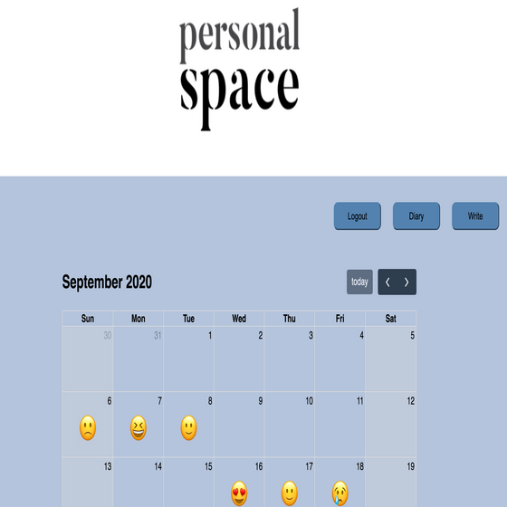

# Personal Space  

 

 
- website url: http://personalspace.co.kr
- A web-based diary, with user authentication, that links daily words with emoticons to track user emotions over time. 
 
  Implemented with html/css, javascript, and bootstrap for front-end, used Flask and AWS server for back-end and MongoDB for database.

## Key features
Log and track user emotions using emoticons  
  
Screen shot of the "write" page where users can select their daily emoticon  
   

